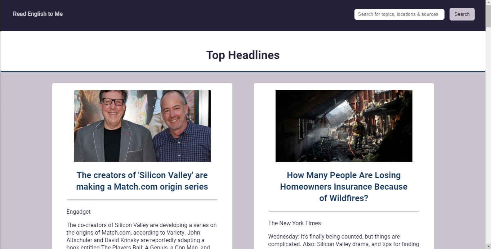
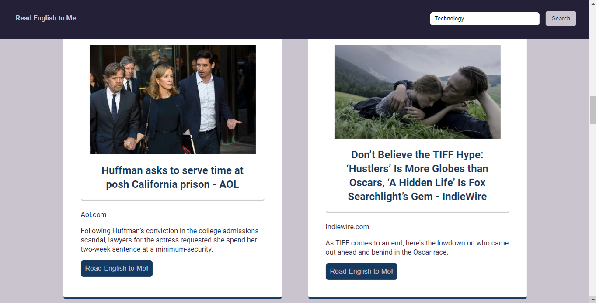

# Read English to Me

[Live Demo](https://christopherjack.github.io/Read_English_to_Me/)

## Summary

This web app was created as a tool for English language learners. It allows the user to search for and listen to news articles in English. 

## Technology Used

HTML | CSS | JavaScript | jQuery

<a href="https://newsapi.org">Powered by News API</a> 
<a href="https://responsivevoice.org">ResponsiveVoice-NonCommercial</a> licensed under 